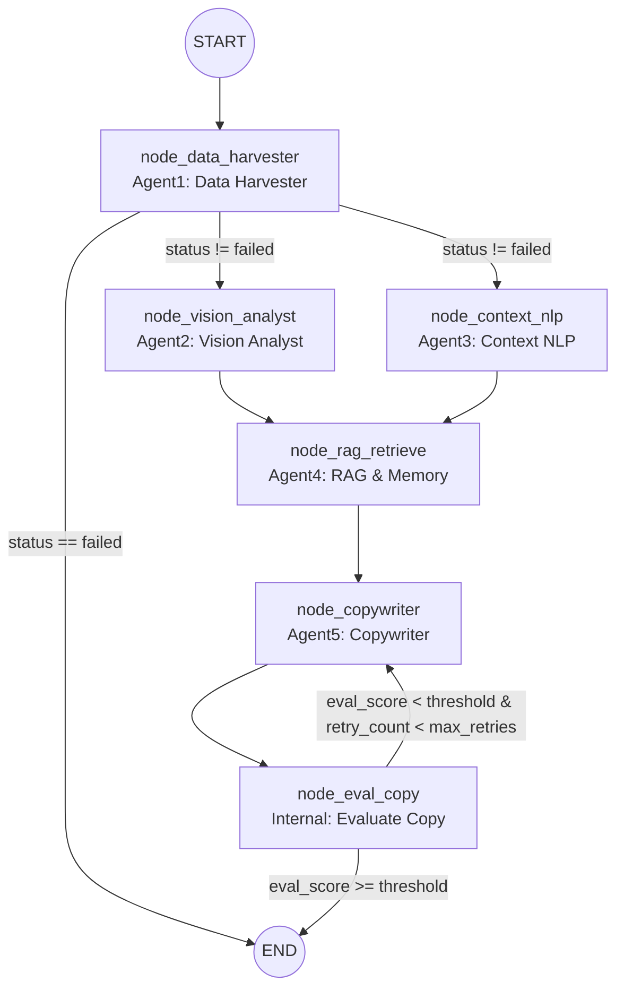

# LangGraph 编排与 State 约定（对齐 `api_settings.md` v0.3.0）

本文档基于 `api_settings.md`（v0.3.0，2026-04-17）中对 **Agent 1～5** 的正式定义（采集清洗→视觉理解→评论语境→RAG 检索→文案生成），给出 LangGraph 的节点（Nodes）、有向边（Edges）与**条件路由**（Conditional Routing）设计，并提供全局 State 结构。

> 重要说明
> - 当前代码中 LangGraph 仅实现了 `package_output`（见 `app/workflows/data_graph.py`）。本文档用于指导“按路线图把五个 Agent 编排成一张有向图”。
> - 现有后端接口 `/api/ad-intel/*` 的 `task_id` 与落盘 `AnalyzeOutput`（四表）可作为短期兼容输入，降低前端传参与数据搬运成本。

---

## 1) 五个 Agent ↔ 节点映射（路线规划版）

| Agent | 职责（按路线图） | LangGraph 节点名（建议） | 主要输入 | 主要输出 |
|------|------------------|---------------------------|----------|----------|
| Agent 1 | 数据采集与清洗（抓取内容/媒体/评论，产出标准 `PostPayload[]` 或等价结构） | `node_data_harvester` | `request_id`、`post_urls`、`options` | `harvest_result`、`status/error_code/error_message` |
| Agent 2 | 多模态视觉理解（图片/帧 → 结构化视觉语境） | `node_vision_analyst` | `harvest_result`（media inputs）或 `task_id` | `vision_report` |
| Agent 3 | 评论区语境与情感（评论 → 情绪/痛点/语言风格/切入角度） | `node_context_nlp` | `harvest_result.comments` 或 `task_id` | `comment_context` |
| Agent 4 | RAG & Memory（用 2/3 特征构造 query → Chroma 召回 few-shot） | `node_rag_retrieve` | `vision_report`、`comment_context`、`product?` | `rag_result` |
| Agent 5 | 核心文案生成（聚合 2/3/4/产品信息 → 多风格候选文案） | `node_copywriter` | `vision_report`、`comment_context`、`rag_result`、`product` | `copy_result`、`eval_score?` |

> 注：
> - Agent 3 在现有实现里是“查询接口”。在图里将其定义为“结果封装/最终输出”节点（`node_result_finalize`），其产物即 `AnalyzeOutput`。
> - 若你希望保持完全一致的命名，也可以把 Agent 3 节点叫 `node_get_task_result`，但在编排语义上 `finalize` 更贴近“图的终点输出”。

---

## 2) 全局 State 定义（GraphState）

### 2.1 字段清单（snake_case，路线规划版 + 现状兼容）

| 字段 | 类型 | 说明 |
|------|------|------|
| `request_id` | string | 规划链路追踪 ID（UUID） |
| `post_urls` | string[] | Agent1 输入：目标帖子链接 |
| `options` | object | Agent1 输入：代理/限流/媒体下载/超时等 |
| `task_id` | string | **兼容现状**：现有任务型接口返回的 12位 hex，用于回读落盘四表/媒体路径 |
| `status` | string | `running/success/failed`（规划/现状皆可用） |
| `error_code` | string\|null | 错误码（LOGIN_REQUIRED 等） |
| `error_message` | string | 错误信息 |
| `harvest_result` | object | Agent1 输出：`HarvestResult`（或等价结构） |
| `vision_report` | object | Agent2 输出：`VisionReport` |
| `comment_context` | object | Agent3 输出：`CommentContextReport` |
| `rag_result` | object | Agent4 输出：`RagRetrieveResult` |
| `product` | object | 规划输入：产品信息（name/selling_points/constraints 等） |
| `copy_result` | object | Agent5 输出：`CopyGenerateResult` |
| `eval_score` | number | 可选：内部评估分数（用于条件边） |
| `retry_count` | integer | 可选：重写计数（用于防止无限循环） |

> 兼容现状补充（可选字段）
> - 若你仍在复用 `/api/ad-intel/run`：可在 `harvest_result` 旁保留 `analyze_output`（四表）与 `processed_file/chroma_counts` 等现有字段，
>   但不建议把它们当作路线规划版 Agent2/3/4/5 的最终输出。

### 2.2 Python TypedDict（用于 `StateGraph`）

```python
from __future__ import annotations

from typing import Any, Literal, TypedDict


class GraphState(TypedDict, total=False):
    # 规划输入
    request_id: str
    post_urls: list[str]
    options: dict[str, Any]
    product: dict[str, Any]

    # 兼容现状（可选）
    task_id: str

    # 运行态
    status: Literal["running", "success", "failed"]
    error_code: str | None
    error_message: str
    retry_count: int

    # Agent1～5 产物
    harvest_result: dict[str, Any]
    vision_report: dict[str, Any]
    comment_context: dict[str, Any]
    rag_result: dict[str, Any]
    copy_result: dict[str, Any]

    # 条件路由用
    eval_score: float
```

---

## 3) 节点定义（输入/输出约定）

### 3.1 `node_data_harvester`（Agent 1）

 - **输入**：`request_id`、`post_urls`、`options`
 - **输出**：
   - 成功：`harvest_result`（建议对齐 `HarvestResult`）、`status="success"`
   - 失败：`status="failed"`、`error_code`、`error_message`

> 现状兼容：若暂用 `/api/ad-intel/run`（关键词抓取）产生 `task_id`，也可在此节点输出 `task_id`，供后续节点回读落盘数据作为替代输入。

### 3.2 `node_vision_analyst`（Agent 2）

- **输入**：`harvest_result`（媒体 inputs）或 `task_id`
- **输出**：`vision_report`

### 3.3 `node_context_nlp`（Agent 3）

- **输入**：`harvest_result`（comments）或 `task_id`
- **输出**：`comment_context`

### 3.4 `node_rag_retrieve`（Agent 4）

- **输入**：`vision_report`、`comment_context`、`product?`
- **输出**：`rag_result`

### 3.5 `node_copywriter`（Agent 5）

- **输入**：`vision_report`、`comment_context`、`rag_result`、`product`
- **输出**：`copy_result`（可选同时写入 `eval_score` 供后续条件边使用）

### 3.6 `node_eval_copy`（内部评估节点，路线图要求的条件路由）

- **输入**：`copy_result`
- **输出**：`eval_score`（0～1 或 0～100，需统一量纲）

---

## 4) 有向边（Edges）与条件路由（Conditional Routing）

### 4.1 主流程（含并行 fan-out）

```text
START
  -> node_data_harvester
  -> (node_vision_analyst  ||  node_context_nlp)   # 并行
  -> node_rag_retrieve
  -> node_copywriter
  -> node_eval_copy
  -> END
```

### 4.2 条件路由：Agent1 失败直接终止

在 `node_data_harvester` 之后，根据 `status` 分流：

- **if `status == "failed"`**：直接 `END`（State 中带 `error_code/error_message`）
- **else**：继续并行触发 `node_vision_analyst` 与 `node_context_nlp`

### 4.3 条件路由：媒体缺失/未下载时跳过 Agent2（可选）

若 `harvest_result` 中无可用媒体（或 `options.enable_media_download=false` 且无外部 uri），可：

- **跳过 `node_vision_analyst`**，并写入一个降级 `vision_report`（例如仅包含 `summary`，items 为空），保证 Agent5 输入结构稳定。

### 4.4 条件路由：文案评分过低 → 打回 Agent5 重写（路线图要求）

在 `node_eval_copy` 之后：

- **if `eval_score < threshold` 且 `retry_count < max_retries`**：`retry_count += 1`，回到 `node_copywriter`
- **else**：`END`

---

## 5) Mermaid 编排图（含条件边）



---

## 6) 条件路由伪代码（LangGraph 写法示意）

```python
from langgraph.graph import START, END, StateGraph

# GraphState 见上文

def route_after_harvest(state: dict) -> str:
    if state.get("status") == "failed":
        return "end"
    return "fanout"


def route_after_eval(state: dict) -> str:
    threshold = 0.75
    max_retries = 2
    score = float(state.get("eval_score", 1.0))
    retry_count = int(state.get("retry_count", 0))
    if score < threshold and retry_count < max_retries:
        return "rewrite"
    return "end"


graph = StateGraph(GraphState)

graph.add_node("node_data_harvester", node_data_harvester)
graph.add_node("node_vision_analyst", node_vision_analyst)
graph.add_node("node_context_nlp", node_context_nlp)
graph.add_node("node_rag_retrieve", node_rag_retrieve)
graph.add_node("node_copywriter", node_copywriter)
graph.add_node("node_eval_copy", node_eval_copy)

graph.add_edge(START, "node_data_harvester")

graph.add_conditional_edges(
    "node_data_harvester",
    route_after_harvest,
    {
        # fan-out：并行触发 vision/context，再汇聚到 rag（可用 StateGraph 的并行模式实现）
        "fanout": "node_vision_analyst",
        "end": END,
    },
)

# fan-out 的另一支
graph.add_edge("node_data_harvester", "node_context_nlp")

# 汇聚到 RAG
graph.add_edge("node_vision_analyst", "node_rag_retrieve")
graph.add_edge("node_context_nlp", "node_rag_retrieve")

graph.add_edge("node_rag_retrieve", "node_copywriter")
graph.add_edge("node_copywriter", "node_eval_copy")

graph.add_conditional_edges(
    "node_eval_copy",
    route_after_eval,
    {
        "rewrite": "node_copywriter",
        "end": END,
    },
)
```

